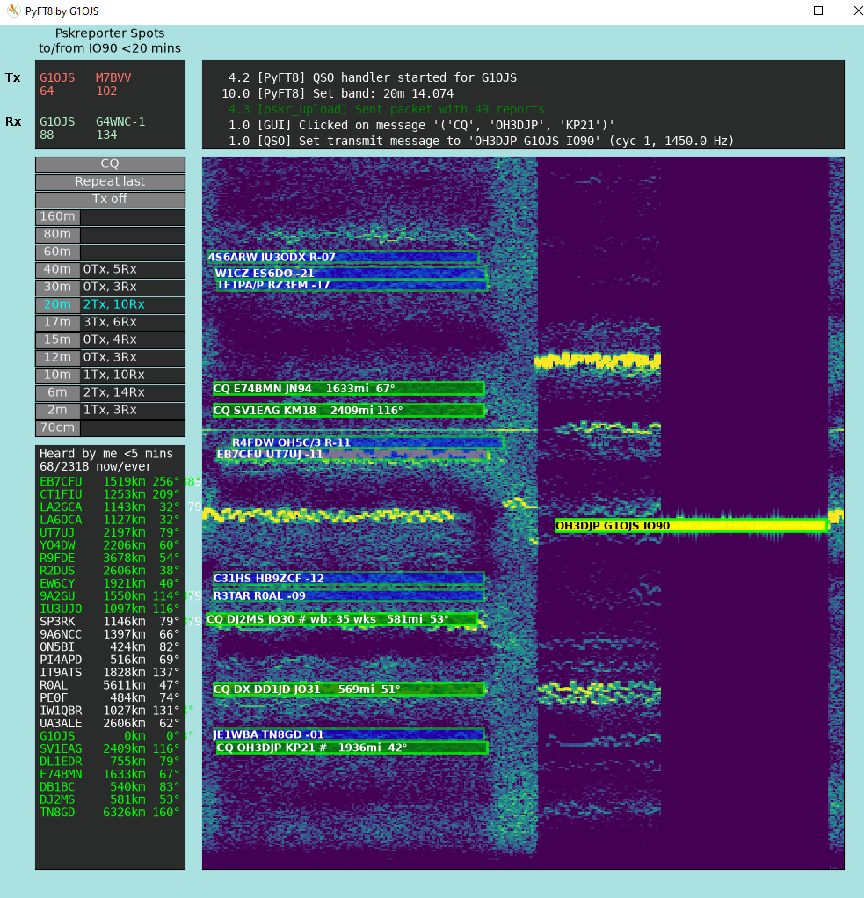

# PyFT8 [](https://pepy.tech/projects/pyft8) [](https://pepy.tech/projects/pyft8)
# All-Python FT8 Transceiver GUI / Command Line Modem

This repository contains the source code for PyFT8, an all-Python open source FT8 transceiver that you can run as a basic GUI or from the command line to receive and transmit. Decoding performance (number of decodes) is about 70% of that achieved by WSJT-x in NORM mode, but (tbc) slightly above ft8_lib. 

PyFT8 is somewhat experimental, with a focus on demonstrating FT8 written in Python, but can be used as a standalone replacement for WSJT-x and other software.

If you're interested in how this works, maybe have a look at [MiniPyFT8](https://github.com/G1OJS/MiniPyFT8) which puts all of the receive code in a single 300 line Python file.

## Features
 - Rx and Tx of standard messages with optional /P and /R, and nonstandard calls plus hashed calls
 - Launches quickly (~2 seconds on my old Dell Optiplex 790)
 - Use with or without gui (receive and send messages via command line commands)
 - Automatically chooses clearest Tx frequency
 - Modern programming language throughout
 - Finds sound cards by keywords so follows them if windows moves them ...
 - Logs QSOs to ADIF file and all spots to WSJTX-style ALL.txt file
 - Uploads spots to pskreporter
 - Direct CAT control for some rigs, designed to drop connection when not used, allowing sharing of rig's serial port
 - Or control rigs via Hamlib

 The Gui shows:
 - Simultaneous views of odd and even cycles
 - Messages overlaid on waterfall signals that produce them
 - Worked-before info and fine grid locators / distance and bearing in the message boxes
 - List of stations hearing your transmissions on the selected band
 - Band activity in your level 4 square live updated next to band select buttons
 - Number of remote stations hearing your Tx, number of remote Txs that you're hearing, plus the same info for the 'best' station in your level 4 square
 - Data used for the above is cached to disk so is not lost when restarting the program

To enable uploading of spots to pskreporter, make sure that your .ini file includes
```
[pskreporter]
upload = Y
```



## Motivation
This started out as me thinking "How hard can it be, really?" after some frustration with Windows moving sound devices around and wanting to get a minimal decoder running that I can fully control. 

I didn’t want to produce yet another port of the original Fortran / C into another language: instead I wanted to see how far I could get following audio -> spectrogram -> symbols -> bits -> error correction without resyncs and special treatments, writing my own code from scratch as far as possible. Also this has been, more than I expected, an exercise in writing Python ‘Pythonically’ for speed, which means absolutely not duplicating the big nested loops of Fortran and C. It also means writing code that is wide and short rather than thin and long, which suits my thinking style perfectly!

## Installation
If you want to install this software without getting into the code, you can install from PyPI using pip install, using

```
pip install PyFT8
```

Once installed, you can use the following commands to run it. Otherwise, please download or browse the code, or fork the repo and play with it! If you do fork it, please check back here as I'm constantly (as of Jan 2026) rewriting and improving.

|Usage | Command example| Notes |
|----------------------|----------------------|----------------------|
|Basic Rx GUI | pyft8 -i "Keyword1, Keyword2" | Keywords identify the input sound device - partial match is fine, e.g. "Mic, CODEC"|
|GUI with transmit | pyft8 -i "Keyword1, Keyword2" -o "Keyword1, Keyword2" | Keywords identify the input (-i) and output (-o) sound devices. The transmit parts are under development.|
| Command line Rx without a GUI | pyft8 -i "Keyword1, Keyword2" -n| |
| Command line transmit | pyft8 -o "Keyword1, Keyword2" -m "CQ G1OJS IO90"| Tx on next cycle. You supply the PTT control method.|
| Command line create a wav file | pyft8 -w "Mywav.wav" -m "CQ G1OJS IO90"| -w "Mywav.wav" can be omitted |
| Launch configured GUI|pyft8 -i "Keyword1, Keyword2" -o "Keyword1, Keyword2" -c {config folder}| Config folder stores PyFT8.ini (your callsign, grid, buttons) and PyFT8.adi log file. Run this once to create default PyFT8.ini file.|

### Rig control 
I've included the Python code that I use with my Icom IC-7100 in the file 'rigctrl.py', and believe I've moved sufficient 'specification' for the rig protocol into the .ini file so that you can paste in your own rig specification (see for e.g. the Omnirig .ini file for your rig) and get it working with PyFT8 controlling PTT and frequency. I designed this code to drop the serial connection when it's not required, so that the rig's serial port can be accessed by other software at the same time.

I've also included a basic Hamlib interface which launches rigctld and uses that to control the rig. To use this, make sure that the hamlib section of the ini file is populated; this will then take precedence over the direct CAT control section.

Alternatively, you can run PyFT8 without rig control; if there is no rig found, PyFT8 defaults to running without a rig connected. In this case, you need to provide your own PTT method and note that the band buttons will only set the information used for logging QSOs to the PyFT8.adi file. Or you can use PyFT8 as Rx-only.

## Performance Compared with FT8_lib and WSJT-x

The image below shows the number of decodes from PyFT8, WSJT-x V2.7.0 running in NORM mode, and FT8_lib, using the same 10 minutes of busy 20m audio that is used to test ft8_lib. 


## Limitations
PyFT8 doesn't decode / encode *all* message types. The table below shows which are handled.

|i3.n3|Known as|Rx|Tx|notes|
|------|--------|----|----|-----|
|0.0|Free Text  |   |   | |
|0.1|DXpedition   |   |   | Call1 RR73; Call2 +07| 
|0.3|Field Day  |   |   |  |
|0.4|Field Day  |   |   |  |
|0.5|Telemetry  |   |   |  |
|1|Std Msg  |Y| Y  |Standard <=6 char callsigns, can include /R  |
|2|EU VHF  |Y|Y| Standard <=6 char callsigns,  can include /P |
|3|RTTY RU   |   |   | |
|4|NonStd Call   |Y|Y| <=11 char callsigns + hashed call|
|5|EU VHF  |   |   | |

## Acknowledgements
This project implements a decoder for the FT8 digital mode.
FT8 was developed by Joe Taylor, K1JT, Steve Franke, K9AN, and others as part of the WSJT-X project.
Protocol details are based on information publicly described by the WSJT-X authors and in related open documentation.

Some constants and tables (e.g. Costas synchronization sequence, LDPC structure, message packing scheme) are derived from 
the publicly available WSJT-X source code and FT8 protocol descriptions. Original WSJT-X source is © the WSJT Development Group 
and distributed under the GNU General Public License v3 (GPL-3.0), hence the use of GPL-3.0 in this repository.

Also thanks to [Robert Morris](https://github.com/rtmrtmrtmrtm) for [basicft8(*1)](https://github.com/rtmrtmrtmrtm/basicft8) - the first code I properly read when I was wondering whether to start this journey. (*1 note: applies to FT8 pre V2)

## Useful resources:
**The QEX paper**
 - [The FT4 and FT8 Communication Protocols](https://wsjt.sourceforge.io/FT4_FT8_QEX.pdf)
 - [Ref 14 from the above paper at the Internet Archive](https://web.archive.org/web/20250409140104/https://www.arrl.org/files/file/QEX%20Binaries/2020/ft4_ft8_protocols.tgz)

Note - section 9 of the QEX paper states that the above two WSJT-X resources are in the public domain, with some restrictions. All other WSJT-X resources including the WSJT-X source code are protected by copyright but licensed under Version 3 of the GNU General Public License (GPLv3).

**WSJTx - focussed:**
 - [WSJT-X on Sourceforge](https://sourceforge.net/p/wsjt)
 - [W4KEK WSJT-x git mirror](https://www.repo.radio/w4kek/WSJT-X) (searchable)

**Other FT8 decoding repos:**
- [weakmon](https://github.com/rtmrtmrtmrtm/weakmon/)
- [FT8_lib](https://github.com/kgoba/ft8_lib)
- ['ft8modem - a command-line software modem for FT8'](https://www.kk5jy.net/ft8modem/) including [source code (C++ and Python)](https://www.kk5jy.net/ft8modem/Software/) (bottom of page)

**FT8 decoding explorations / explanations**
 - [VK3JPK's FT8 notes](https://github.com/vk3jpk/ft8-notes) including comprehensive [Python source code](https://github.com/vk3jpk/ft8-notes/blob/master/ft8.py)
 - [G4JNT notes on LDPC coding process](http://www.g4jnt.com/WSJT-X_LdpcModesCodingProcess.pdf)
 - [Kristian Glass's 2025-05-06 Understanding the FT8 binary protocol](https://notes.doismellburning.co.uk/notebook/2025-05-06-understanding-the-ft8-binary-protocol/)

**FT8 decoding in hardware**
 - [Optimizing the (Web-888) FT8 Skimmer Experience](https://www.rx-888.com/web/design/digi.html) (see also [RX-888 project](https://www.rx-888.com/) )
 - ['DX-FT8-Transceiver' source code](https://github.com/chillmf/DX-FT8-Transceiver-Source-Code_V2), the firmware part of the [DX-FT8 Transceiver project](https://github.com/WB2CBA/DX-FT8-FT8-MULTIBAND-TABLET-TRANSCEIVER)
   
**FT8 encode/decode simulators:**
 - [FT8Play - full details of message to bits etc](https://pengowray.github.io/ft8play/)
 - [Post about ft8play](https://groups.io/g/FT8-Digital-Mode/topic/i_made_a_thing_ft8play/107846361)

**Browser-based decoder/encoders**
 - [ft8js by e04](https://e04.github.io/ft8js/example/browser/index.html) - source [github](https://github.com/e04/ft8js?tab=readme-ov-file), uses web-assembled version of [FT8_lib](https://github.com/kgoba/ft8_lib)
 - [ft8ts by e04](https://github.com/e04/ft8ts), - pure TypeScript implementation
 - [ChromeFT8 Browser Extension](https://github.com/Transwarp8/ChromeFT8), decoder adapted from [ft8js](https://e04.github.io/ft8js/example/browser/index.html)

<script data-goatcounter="https://g1ojs-github.goatcounter.com/count" async src="//gc.zgo.at/count.js"></script>
